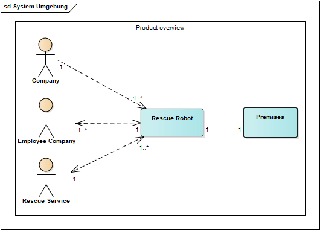

# Rescue-Robot

In Fällen wie Naturkatastrophen oder schweren Industrieunfällen ist es meist dringend notwendig, verletzte Personen zu retten oder Gegenstände zu bergen.
Um dabei nicht andere Menschen den Risiken oder Gefahren auszusetzen, ist es sehr hilfreich, Roboter einzusetzen. In diesem Projekt soll ein "Rescue-Robot"
entwickelt werden, der bei einem Industrieunfall wie einer Explosion seinen Einsatz findet. Bei der Explosion wurden auch radioaktive Objekte auf dem Industriegelände verteilt.

#
### Produkteinsatz
Zur Zielgruppe gehören nicht nur das Industriegewerbe selbst, sondern auch Rettungsdienste, die direkten Angestellten der Firma, sowie das Firmengelände selbst.

#
### Einsatzgebiet
Der Rescue-Robot soll sich autonom auf dem Industriegelände bewegen und sich über Radiosignale navigieren. Hindernisse wie Gesteinsbrocken oder Wasser sollen umfahren oder durchquert werden. Verletzte Personen sollen über den Rescue-Robot nach außen kommunizieren können. Zudem sollen auch radioaktive Gegenstände gesichert werden können.

#
### Allgemeines zum Projekt
Die Übersicht über die geplante und getane Arbeit für jede Woche ist mit GitHub-Projects umgesetzt:  
[Project Boards][projects]

Die Allgemeine Übersicht über die gesamten Aufgaben ist auf [Trello][trello] zu finden.

#
### Requirements

<table>
<thead>
  <tr>
    <th>Category</th>
    <th>ID</th>
    <th>Requirement</th>
  </tr>
</thead>
<tbody>
  <tr>
    <td rowspan="4">Fortbewegung</td>
    <td>FR1</td>
    <td>Fahrzeug muss sich an Land fortbewegen können</td>
  </tr>
  <tr>
    <td>NFR1</td>
    <td>Fortbewegung muss über Ketten laufen</td>
  </tr>
  <tr>
    <td>FR2</td>
    <td>Fahrzeug muss sich auf der Wasseroberfläche fortbewegen können</td>
  </tr>
  <tr>
    <td>NFR2</td>
    <td>Fortbewegung muss über eine Turbine und ein Ruder laufen</td>
  </tr>
  <tr>
    <td rowspan="4">Gegenstände bergen</td>
    <td>FR3</td>
    <td>Das Fahrzeug muss Gegenstände greifen können</td>
  </tr>
  <tr>
    <td>NFR3.1</td>
    <td>Das Fahrzeug muss über einen beweglichen Greifer verfügen</td>
  </tr>
  <tr>
    <td>FR4</td>
    <td>Das Fahrzeug muss über einen verschließbaren Behälter verfügen</td>
  </tr>
  <tr>
    <td>NFR5</td>
    <td>Das Fahrzeug muss über einen offenen Behälter verfügen</td>
  </tr>
  <tr>
    <td rowspan="3">Sensorik</td>
    <td>FR6</td>
    <td>Das Fahrzeug muss Radiosignalen folgen können </td>
  </tr>
  <tr>
    <td>FR7</td>
    <td>Das Fahrzeug muss erkennen ob es im Wasser ist</td>
  </tr>
  <tr>
    <td>NFR8</td>
    <td>Das Fahrzeug muss über geeignete Peripherie verfügen  um mit Menschen zu kommunizieren</td>
  </tr>
  <tr>
    <td rowspan="4">Wartbarkeit</td>
    <td>NFR9</td>
    <td>Motoren oder Turbine müssen leicht zugänglich sein. </td>
  </tr>
  <tr>
 </tr>
</tbody>
</table>

[projects]: https://github.com/BrunoBerger/Rescue-Robot/projects
[trello]: https://trello.com/b/mJtKk2EW/rescue-robot
